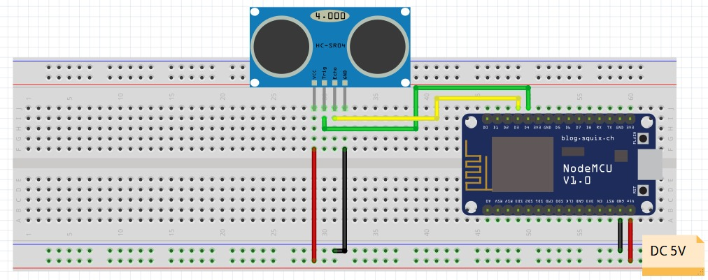

# **IoT-Distance-Socket**
This is a demo project based on socket.io and express under KGEC-Robotics-Society.

For the server side, visit [IoT-Socket-Server](https://github.com/PSR0001/Robotics_Orientation).

## **Contents**
1. [Description](#description)
0. [Installation](#installation)
0. [Languages](#languages)
0. [Contribution](#contribution)

## **Description**

<br>


## **Circuit Diagram**

<br>
<br>
<br>
<br>
<br>
<br>
<br>
<br>
<br>
<br>


[Ultrasonic Sensor HC-SR04 (SEN-15569)](https://www.maxbotix.com/articles/how-ultrasonic-sensors-work.htm#:~:text=An%20ultrasonic%20sensor%20is%20an,information%20about%20an%20object's%20proximity.)

This is the HC-SR04 ultrasonic ranging sensor. This economical sensor provides 2cm to 400cm of non-contact measurement functionality with a ranging accuracy that can reach up to 3mm.


## **Installation**
   ### Softeares Required :
   * [visual Studio Code](https://code.visualstudio.com/download)
   * [Platform IO](https://platformio.org/install)
   * [Arduino Framework](https://www.arduino.cc/d)

## **Libraries :**
 
 * [ArduinoJson](https://github.com/bblanchon/ArduinoJson)
 * [WebSockets.h for ESP8266](https://github.com/Links2004/arduinoWebSockets)

_Just install Platform IO from VS Code extensions, open the repository on VS code and start working on the main.cpp inside ```src/main.cpp```  ._

## **Languages**

- 
<br>


## **Contribution**
This is a concept for beginners starting with IoT. Feel free to fork, clone, create issues and/or make PRs. We will be more than happy to receive your contributions.


